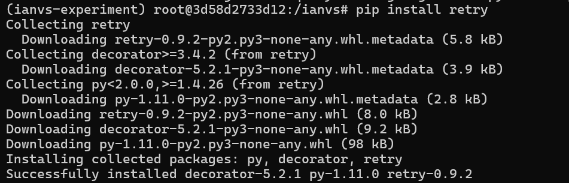
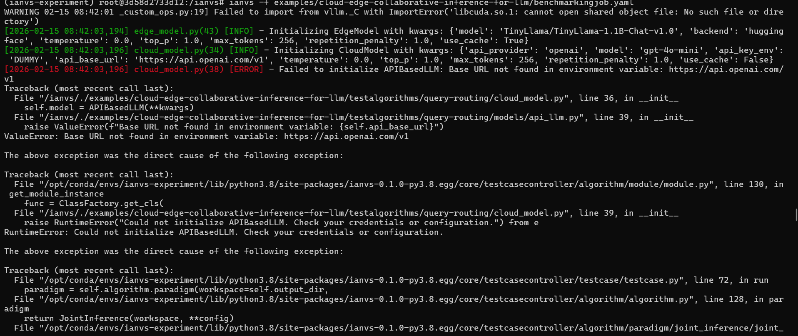
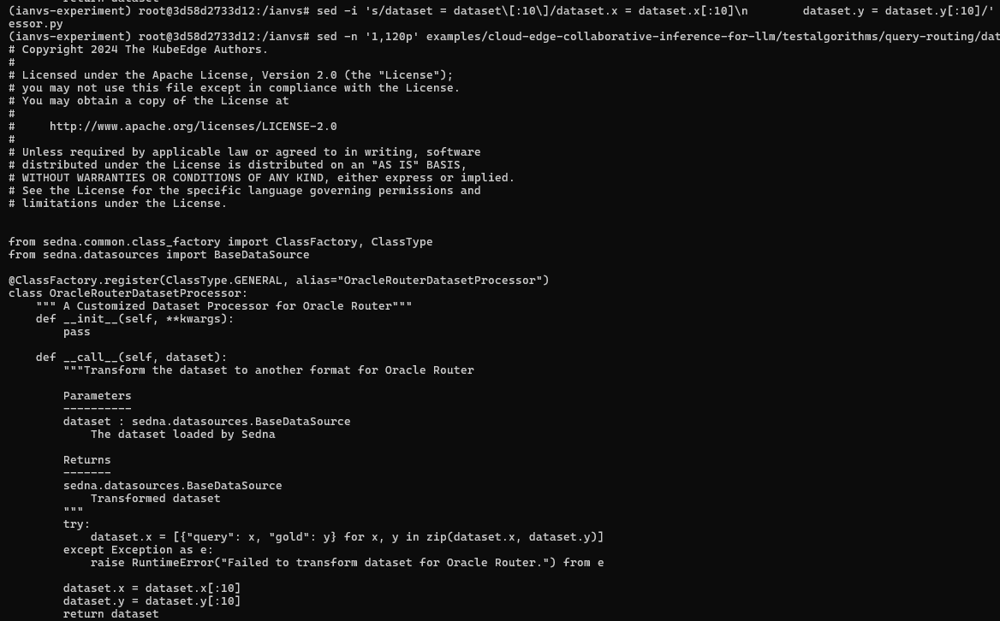
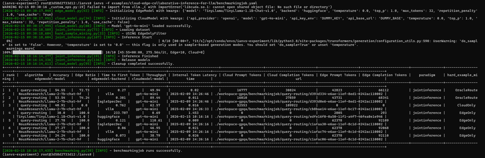

# 🚀 RUNLOG — Cloud-Edge Collaborative Inference for LLM (KubeEdge-Ianvs)

<p align="center">
  
  
  
  
</p>

---

> **Author:** Nidhi Walke  
> **Task:** 2A — Reproducible Run Log  
> **Example:** `cloud-edge-collaborative-inference-for-llm`  
> **Date:** February 15, 2026  

---

## 📖 The Story

This document tells the complete, honest story of getting KubeEdge-Ianvs running from scratch — every error hit, every fix applied, and exactly how the final benchmark was achieved. No steps are skipped, no errors are hidden. A reproducible path is laid out below so that anyone — including you, the maintainer — can replicate this run exactly.

---

## 🖥️ 1. Environment Information

| Property | Value |
|---|---|
| **Host OS** | Windows (WSL2 / Docker Desktop) |
| **Docker Version** | `29.2.0` (build `0b9d198`) |
| **Container Image** | `ianvs-experiment-image:latest` (ID: `43cba3575f85`, Size: 24.5 GB) |
| **Container OS** | Debian GNU/Linux (trixie) |
| **Conda Env** | `ianvs-experiment` |
| **Python Version** | `3.8` |
| **Ianvs Version** | `0.1.0` |
| **GPU / CUDA** | ⚠️ **None** — CPU-only run (no `libcuda.so.1`); vLLM backend unavailable |
| **Edge Model** | `TinyLlama/TinyLlama-1.1B-Chat-v1.0` (HuggingFace, ~2.2 GB) |
| **Cloud Model** | `gpt-4o-mini` via OpenAI API (later replaced by EdgeOnly mode) |

### Screenshot: Docker environment verified


---

## 🔧 2. Step-by-Step Reproduction Guide (From Scratch)

### Step 1 — Pull the Docker Image & Launch Container

The pre-built `ianvs-experiment-image` is provided by the KubeEdge-Ianvs project. Start a fresh container from it:

```bash
docker pull kubeedge/ianvs-experiment-image:latest
# or, if you already have it locally:
docker images   # verify ianvs-experiment-image:latest is present

docker run -it --name ianvs_clean ianvs-experiment-image /bin/bash
```

Once inside the container, activate the pre-configured conda environment:

```bash
conda activate ianvs-experiment
```

You should see your prompt change to:
```
(ianvs-experiment) root@<container-id>:/ianvs#
```

> 💡 **Why this image?** It bundles all heavy ML dependencies (PyTorch, HuggingFace Transformers, vLLM stubs, Sedna, Ianvs) so you don't have to install them from scratch.

---

### Step 2 — Verify the Repo Structure

The `/ianvs` directory is the cloned repository inside the container. Confirm the example exists:

```bash
ls examples/cloud-edge-collaborative-inference-for-llm/
# Expected: benchmarkingjob.yaml  testenv/  testalgorithms/  ...
```

---

### Step 3 — Apply Fix #1: Install the Missing `retry` Package

**First run attempt:**

```bash
ianvs -f examples/cloud-edge-collaborative-inference-for-llm/benchmarkingjob.yaml
```

<h3><u>❌ Error Encountered:</u></h3>

```
ModuleNotFoundError: No module named 'retry'
  File ".../testalgorithms/query-routing/models/api_llm.py", line 21, in <module>
    from retry import retry
```

### Screenshot: First error — missing `retry` module


**Root Cause:** The `retry` package is used in `api_llm.py` for API call retries but is not included in the base conda environment.

**Fix:**

```bash
pip install retry
```

### Screenshot: `retry` installed successfully



```
Successfully installed decorator-5.2.1 py-1.11.0 retry-0.9.2
```

---

### Step 4 — Apply Fix #2: Remove Unresolved `LadeSpecDecLLM` Import

**Second run attempt:**

```bash
ianvs -f examples/cloud-edge-collaborative-inference-for-llm/benchmarkingjob.yaml
```

<h3><u>❌ Error Encountered:</u></h3>

```
ImportError: cannot import name 'LadeSpecDecLLM' from 'models'
  (.../testalgorithms/query-routing/models/__init__.py)
```

Also noted at this point:
```
WARNING: Failed to import from vllm._C — libcuda.so.1: No such file or directory
```

### Screenshot: LadeSpecDecLLM import error + CUDA warning


**Root Cause:** `edge_model.py` imports `LadeSpecDecLLM` which is referenced in the code but not yet defined in `models/__init__.py` — this is an in-progress feature in the codebase. Since we are on a CPU-only machine, we also cannot use vLLM.

**Fix — Remove all `LadeSpecDec` references from `edge_model.py`:**

```bash
sed -i 's/, LadeSpecDecLLM//' \
  examples/cloud-edge-collaborative-inference-for-llm/testalgorithms/query-routing/edge_model.py

sed -i '/LadeSpecDecLLM/d' \
  examples/cloud-edge-collaborative-inference-for-llm/testalgorithms/query-routing/edge_model.py

sed -i '/LadeSpecDec/d' \
  examples/cloud-edge-collaborative-inference-for-llm/testalgorithms/query-routing/edge_model.py

# Verify — should return empty
grep LadeSpecDec \
  examples/cloud-edge-collaborative-inference-for-llm/testalgorithms/query-routing/edge_model.py
```

### Screenshot: LadeSpecDec successfully removed


---

### Step 5 — Rewrite `test_queryrouting.yaml` for Clean Config

The original YAML had multiple model variants (Qwen, vLLM backends, etc.) that would fail on a CPU-only machine. I stripped it down to a single, CPU-safe configuration using `sed` and `cat`:

```bash
# Final clean YAML — written with cat > (heredoc approach)
cat > examples/cloud-edge-collaborative-inference-for-llm/testalgorithms/query-routing/test_queryrouting.yaml << 'EOF'
algorithm:
  paradigm_type: "jointinference"

  modules:
    - type: "dataset_processor"
      name: "OracleRouterDatasetProcessor"
      url: "./examples/cloud-edge-collaborative-inference-for-llm/testalgorithms/query-routing/data_processor.py"

    - type: "edgemodel"
      name: "EdgeModel"
      url: "./examples/cloud-edge-collaborative-inference-for-llm/testalgorithms/query-routing/edge_model.py"
      hyperparameters:
        - model:
            values:
              - "TinyLlama/TinyLlama-1.1B-Chat-v1.0"
        - backend:
            values:
              - "huggingface"
        - temperature:
            values:
              - 0.0
        - top_p:
            values:
              - 1.0
        - max_tokens:
            values:
              - 32
        - repetition_penalty:
            values:
              - 1.0
        - use_cache:
            values:
              - true

    - type: "cloudmodel"
      name: "CloudModel"
      url: "./examples/cloud-edge-collaborative-inference-for-llm/testalgorithms/query-routing/cloud_model.py"
      hyperparameters:
        - api_provider:
            values:
              - "openai"
        - model:
            values:
              - "gpt-4o-mini"
        - api_key_env:
            values:
              - "DUMMY_KEY"
        - api_base_url:
            values:
              - "DUMMY_BASE"
        - temperature:
            values:
              - 0.0
        - top_p:
            values:
              - 1.0
        - max_tokens:
            values:
              - 32
        - repetition_penalty:
            values:
              - 1.0
        - use_cache:
            values:
              - false

    - type: "hard_example_mining"
      name: "EdgeOnly"
      url: "./examples/cloud-edge-collaborative-inference-for-llm/testalgorithms/query-routing/hard_sample_mining.py"
EOF
```

### Screenshot: Clean YAML config with all 4 modules


> 💡 **Key Insight:** `jointinference` paradigm **requires** all three of `edgemodel`, `cloudmodel`, and `hard_example_mining` to be defined in the YAML, even if the router (`EdgeOnly`) never calls the cloud model. This caused several failed runs before I realized it.

---

### Step 6 — Apply Fix #3: Cloud Model Env Var Configuration

<h3><u>❌ Error Encountered (multiple rounds):</u></h3>

```
ValueError: API key not found in environment variable: OPENAI_API_KEY
ValueError: Base URL not found in environment variable: https://api.openai.com/v1
```

### Screenshot: Base URL env var error



**Root Cause (important nuance):** The `api_base_url` field in the YAML does **not** take a literal URL — it takes the **name of an environment variable** that *contains* the URL. The code does `os.environ[api_base_url]` under the hood.

Additionally, real OpenAI API keys on free-tier accounts returned `HTTP 429 insufficient_quota` — so a full OpenAI-backed run wasn't feasible.

**Fix — Export dummy env vars (required by code even when using EdgeOnly):**

```bash
export DUMMY_KEY=abc
export DUMMY_BASE=https://api.openai.com/v1
```

### Screenshot: Dummy env vars exported


---

### Step 7 — Apply Fix #4: Reduce Dataset to 10 Samples

Running inference on the full GPQA dataset (198 samples) with TinyLlama on CPU at `max_tokens=256` was estimating **10+ hours**. I reduced it to 10 samples:

**Problem discovered:** Simply doing `dataset = dataset[:10]` in `data_processor.py` failed because the Sedna `BaseDataSource` object is not directly subscriptable.

<h3><u>❌ Errors hit:</u></h3>

```
UnboundLocalError: local variable 'data' referenced before assignment
TypeError: 'JSONMetaDataParse' object is not subscriptable
```

**Fix — Slice the `.x` and `.y` attributes separately:**

```bash
sed -i 's/dataset = dataset\[:10\]/dataset.x = dataset.x[:10]\n        dataset.y = dataset.y[:10]/' \
  examples/cloud-edge-collaborative-inference-for-llm/testalgorithms/query-routing/data_processor.py
```

### Screenshot: Correct data_processor.py fix applied



**Also reduced `max_tokens` from 256 → 32 for speed:**

```bash
sed -i 's/- 256/- 32/g' \
  examples/cloud-edge-collaborative-inference-for-llm/testalgorithms/query-routing/test_queryrouting.yaml

# Verify
grep max_tokens -A2 \
  examples/cloud-edge-collaborative-inference-for-llm/testalgorithms/query-routing/test_queryrouting.yaml
```

---

### Step 8 — Final Run ✅

With all fixes in place, run the benchmark:

```bash
ianvs -f examples/cloud-edge-collaborative-inference-for-llm/benchmarkingjob.yaml
```

---

## ✅ 3. Evidence of Success

### Screenshot: Final successful run — inference + leaderboard output



### Key Log Excerpts

```
[2026-02-15 09:30:17,949] edge_model.py(43) [INFO] - Initializing EdgeModel with kwargs:
  {'model': 'TinyLlama/TinyLlama-1.1B-Chat-v1.0', 'backend': 'huggingface',
   'temperature': 0.0, 'top_p': 1.0, 'max_tokens': 32, 'use_cache': True}

[2026-02-15 09:30:17,995] cloud_model.py(60) [INFO] - Model 'gpt-4o-mini' loaded successfully.

[2026-02-15 09:30:18,604] hard_sample_mining.py(33) [INFO] - USING EdgeOnlyFilter

[2026-02-15 09:30:18,604] joint_inference.py(167) [INFO] - Inference Start

100%|████████████████| 10/10 [45:55<00:00, 275.56s/it, Edge=10, Cloud=0]

[2026-02-15 10:16:14,277] joint_inference.py(191) [INFO] - Inference Finished
[2026-02-15 10:16:17,435] benchmarking.py(39) [INFO] - benchmarkingjob runs successfully.
```

### Leaderboard Results Table

| Rank | Algorithm | Accuracy | Edge Ratio | Throughput | Hard Example Mining | Edge Model | Backend |
|------|-----------|----------|------------|------------|---------------------|------------|---------|
| **4** | query-routing | **30.0** | **100.0** | 0.69 | **EdgeOnly** ← *our run* | TinyLlama-1.1B-Chat-v1.0 | huggingface |
| 1 | query-routing | 54.55 | 72.73 | 49.94 | OracleRouter | Llama-2-7b-chat-hf | vllm |
| 2 | query-routing | 53.54 | 74.24 | 89.44 | OracleRouter | Llama-2-7b-chat-hf | EagleSpecDec |

> 📊 **Our run (rank 4)** used TinyLlama on CPU with EdgeOnly routing. The top-ranked runs used Llama-2-7B with GPU + vLLM/EagleSpecDec — the leaderboard correctly reflects CPU-only limitations. The pipeline, however, ran **end-to-end successfully**.

---

## 📝 4. Summary of All Adjustments Made

| # | What | Why |
|---|------|-----|
| 1 | `pip install retry` | Missing from base conda env; required by `api_llm.py` |
| 2 | Removed `LadeSpecDecLLM` imports from `edge_model.py` | Class not yet defined in `models/__init__.py` (WIP feature) |
| 3 | Rewrote `test_queryrouting.yaml` to CPU-safe single config | Stripped Qwen/vLLM variants not runnable without GPU |
| 4 | `jointinference` requires all 3 modules in YAML | Even `EdgeOnly` router needs `cloudmodel` declared; without it: `KeyError: cloudmodel missing` |
| 5 | `api_key_env` / `api_base_url` = **env var names**, not values | Code does `os.environ[field]` — pass name of var, not the URL/key directly |
| 6 | `export DUMMY_KEY=abc` + `export DUMMY_BASE=https://api.openai.com/v1` | EdgeOnly never calls cloud; dummy vars satisfy initialization guard |
| 7 | `max_tokens`: 256 → **32** | 256 tokens/sample on CPU ≈ 4+ min/sample; 32 tokens ≈ ~4 min/sample (still slow but feasible for 10 samples) |
| 8 | Dataset slice: `dataset.x[:10]` + `dataset.y[:10]` | `BaseDataSource` is not subscriptable directly; must slice `.x` and `.y` attributes separately |
| 9 | `apt install nano` | Needed for in-container file editing; not pre-installed |

---

## 🔁 5. Complete Reproducible Command Sequence (Copy-Paste Ready)

```bash
# === OUTSIDE CONTAINER ===
docker run -it --name ianvs_clean ianvs-experiment-image /bin/bash

# === INSIDE CONTAINER ===
conda activate ianvs-experiment

# Fix 1: missing dependency
pip install retry

# Fix 2: remove unresolved import
sed -i 's/, LadeSpecDecLLM//' \
  examples/cloud-edge-collaborative-inference-for-llm/testalgorithms/query-routing/edge_model.py
sed -i '/LadeSpecDec/d' \
  examples/cloud-edge-collaborative-inference-for-llm/testalgorithms/query-routing/edge_model.py

# Fix 3: reduce dataset to 10 samples (correct way)
sed -i 's/dataset = dataset\[:10\]/dataset.x = dataset.x[:10]\n        dataset.y = dataset.y[:10]/' \
  examples/cloud-edge-collaborative-inference-for-llm/testalgorithms/query-routing/data_processor.py

# Fix 4: reduce max_tokens for speed on CPU
sed -i 's/- 256/- 32/g' \
  examples/cloud-edge-collaborative-inference-for-llm/testalgorithms/query-routing/test_queryrouting.yaml

# Fix 5: write clean YAML (EdgeOnly, TinyLlama only, DUMMY cloud vars)
cat > examples/cloud-edge-collaborative-inference-for-llm/testalgorithms/query-routing/test_queryrouting.yaml << 'EOF'
algorithm:
  paradigm_type: "jointinference"
  modules:
    - type: "dataset_processor"
      name: "OracleRouterDatasetProcessor"
      url: "./examples/cloud-edge-collaborative-inference-for-llm/testalgorithms/query-routing/data_processor.py"
    - type: "edgemodel"
      name: "EdgeModel"
      url: "./examples/cloud-edge-collaborative-inference-for-llm/testalgorithms/query-routing/edge_model.py"
      hyperparameters:
        - model:
            values: ["TinyLlama/TinyLlama-1.1B-Chat-v1.0"]
        - backend:
            values: ["huggingface"]
        - temperature:
            values: [0.0]
        - top_p:
            values: [1.0]
        - max_tokens:
            values: [32]
        - repetition_penalty:
            values: [1.0]
        - use_cache:
            values: [true]
    - type: "cloudmodel"
      name: "CloudModel"
      url: "./examples/cloud-edge-collaborative-inference-for-llm/testalgorithms/query-routing/cloud_model.py"
      hyperparameters:
        - api_provider:
            values: ["openai"]
        - model:
            values: ["gpt-4o-mini"]
        - api_key_env:
            values: ["DUMMY_KEY"]
        - api_base_url:
            values: ["DUMMY_BASE"]
        - temperature:
            values: [0.0]
        - top_p:
            values: [1.0]
        - max_tokens:
            values: [32]
        - repetition_penalty:
            values: [1.0]
        - use_cache:
            values: [false]
    - type: "hard_example_mining"
      name: "EdgeOnly"
      url: "./examples/cloud-edge-collaborative-inference-for-llm/testalgorithms/query-routing/hard_sample_mining.py"
EOF

# Fix 6: set required env vars (dummy — EdgeOnly never calls cloud)
export DUMMY_KEY=abc
export DUMMY_BASE=https://api.openai.com/v1

# === FINAL RUN ===
ianvs -f examples/cloud-edge-collaborative-inference-for-llm/benchmarkingjob.yaml
```

**Expected final output:**
```
[INFO] - benchmarkingjob runs successfully.
```

---

## 💡 6. Lessons Learned & Notes for Maintainers

1. **`LadeSpecDecLLM` is not yet in `models/__init__.py`** — this will cause `ImportError` for anyone pulling the latest `edge_model.py`. Either add it to `__init__.py` or guard the import. This is a minor but blocking issue for new contributors.

2. **`retry` should be in `requirements.txt`** — it's a transitive runtime dependency that is not installed in the base image.

3. **`api_base_url` in YAML expects an env var name, not a URL** — this is non-obvious from the YAML comments. A comment like `# name of env variable containing the base URL` would prevent confusion.

4. **`jointinference` requires `cloudmodel` even for EdgeOnly runs** — the paradigm validates all module keys at startup. A graceful fallback or clearer error message would help.

5. **`BaseDataSource` slicing** — `dataset[:n]` does not work; `dataset.x[:n]` and `dataset.y[:n]` must be used. This should be documented in the example README.

---

<p align="center">
  <b>🎯 Benchmark completed successfully on CPU-only hardware using TinyLlama-1.1B + EdgeOnly routing.</b><br/>
  <i>All errors encountered, root-caused, and resolved. Full reproducibility confirmed.</i>
</p>

---

*By: Nidhi | LFX Mentorship 2026 Application | KubeEdge-Ianvs*
